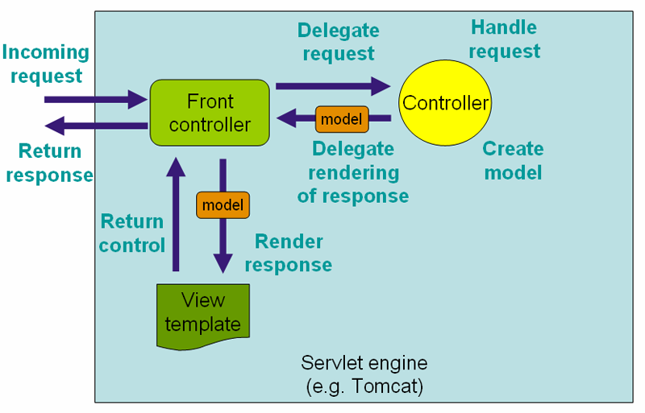
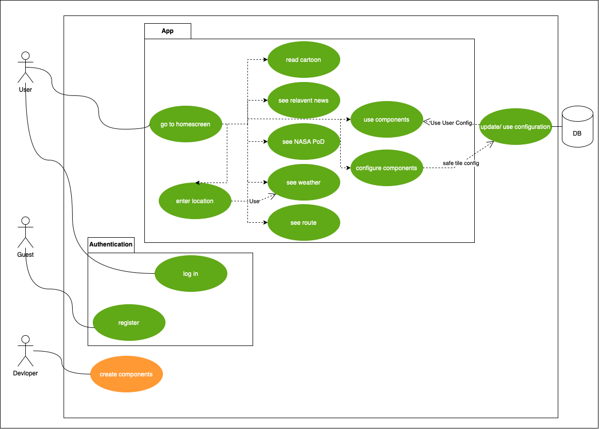
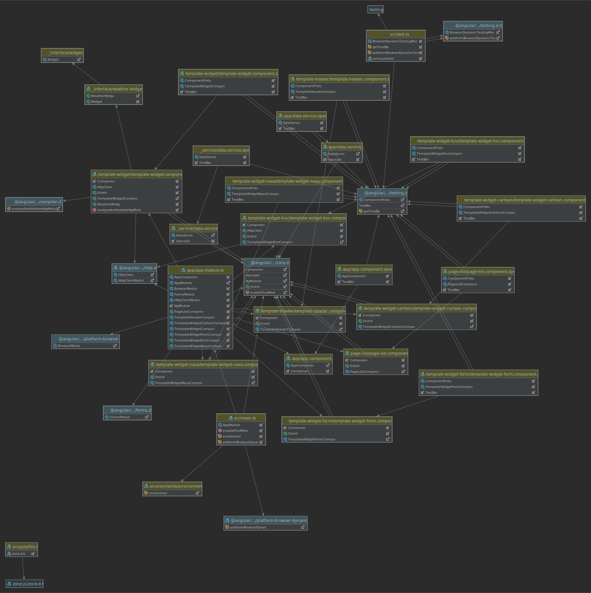
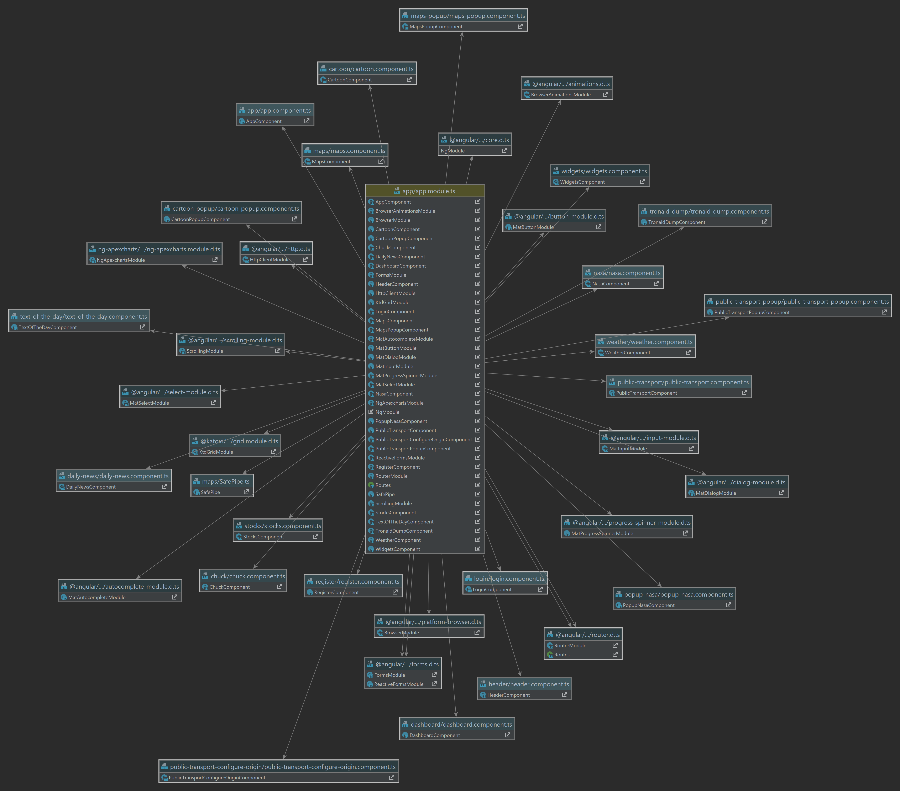

# Software Architecture Document

### Version 1.2

# Revision history

| Date       | Version | Description                                          | Author           |
|------------|---------|------------------------------------------------------|------------------|
| 30/11/2021 | 1.0     | Initial Documentation                                | Fabian Hagner    |
| 19/04/2022 | 1.1     | Fixing Errors in the Document                        | Rafael Lüdtke    |
| 29/06/2022 | 1.2     | Final Handover                                       | Rafael Lüdtke    |

# Table of Contents
- [Introduction](#1-introduction)
    - [Purpose](#11-purpose)
    - [Scope](#12-scope)
    - [Definitions, Acronyms and Abbreviations](#13-definitions-acronyms-and-abbreviations)
    - [References](#14-references)
    - [Overview](#15-overview)
- [Architectural Representation](#2-architectural-representation)
- [Architectural Goals and Constraints](#3-architectural-goals-and-constraints)
- [Use-Case View](#4-use-case-view)
- [Logical View](#5-logical-view)
    - [Overview](#51-overview)
    - [Architecturally Significant Design Packages](#52-architecturally-significant-design-packages)
- [Process View](#6-process-view)
- [Deployment View](#7-deployment-view)
- [Implementation View](#8-implementation-view)
    - [Overview](#81-overview)
    - [Layers](#82-layers)
- [Data View](#9-data-view)
- [Size and Performance](#10-size-and-performance)
- [Quality/Metrics](#11-qualitymetrics)

## 1. Introduction

### 1.1 Purpose

This document provides a comprehensive architectural overview of the system, using a number of different architectural 
views to depict different aspects of the system. It is intended to capture and convey the significant architectural 
decisions which have been made on the system.

### 1.2 Scope

This document describes the technical architecture of papatohu, including module structure and dependencies as 
well as the structure of classes.

### 1.3 Definitions, Acronyms and Abbreviations

| Abbreviation | Description                            |
| ------------ | -------------------------------------- |
| API          | Application programming interface      |
| MVC          | Model View Controller                  |
| REST         | Representational state transfer        |
| SDK          | Software development kit               |
| SRS          | Software Requirements Specification    |
| UC           | Use Case                               |
| VCS          | Version Control System                 |
| N/A          | Not Applicable                         |
| DAO          | Data Access Object                     |
| DTO          | Data Transfer Object                   |
| n/a          | not applicable                         |

### 1.4 References

| Reference                                                                             | Date       |
|---------------------------------------------------------------------------------------|------------|
| <a href="https://papatohu.wordpress.com">Papatohu Blog</a>                            | 30/11/2021 |
| <a href="https://github.com/papatohu">GitHub Repository</a>                           | 30/11/2021 |

### 1.5 Overview

This document contains the architectural representation, goals and constraints as well as logical, deployment, 
implementation and data views.

## 2. Architectural Representation

Our project uses the classic Spring Web MVC structure as follows:

## 3. Architectural Goals And Constraints

As our main technology we decided to use Spring Web MVC, which is a framework that takes care of the backend and makes it possible to connect to our frontend which is managed with Angular. 
Our decision fell onto Spring and Angular, as we all have experience in Java and JavaScript, which makes it possible for each project member to understand all the code written for this project.
The main architectural goal of this project is to support an easy to used Web-App. We used an MongoDB as a fast Database and to take advantage of the fact that MongoDB does not require all documents to be the same. This made it easy to store the user configuration, as the order of the tiles is changed in the array when the user drag and drops it on his site.

## 4. Use-Case View

This is our overall use-case diagram:

green = finished; orange = possible feature, not in current scope; blue = in progress; white = planed;

## 5. Logical View

### 5.1 Overview

After refactoring our Code regarding Design Pattern we have a updated Overview:

### 5.2 Architecturally Significant Design Packages

We created for every part of our project a seperate component with seperate CSS and let Angular put everything together.

## 6. Process View

n/a

## 7. Deployment View

n/a

## 8. Implementation View

n/a

## 9. Data View
We chose a MongoDB as our Database, as it fits nicley in our usecase for our user config.

## 10. Size and Performance

n/a

## 11. Quality/Metrics

We used Codacy to control  our code quality, in which the Frontend and the Backend got an A. 
We used the integrated tools of WebStorm and IntelliJ to calculated our test coverage. The Unit Test as well as the API-Test are used to ensure that our application runs without any errors.

The Cyclomatic complexity is a metric we took a look at in our Backend, to ensure that all request are fast, and the program has as few as possible decisions to make.

## 12. Patterns

In Angular, ther is a concept called services. The services can be used to seperate structural code from the UI related code of a components typescript class.
The first step was to put all code in the components typescript class, although there is this services concept.
The following 2 examples show the weather component before and after applying the pattern.

