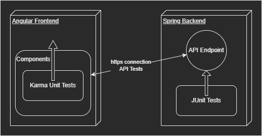

# Test Plan for Papatohu

## Table of contents

- [Test Plan for Papatohu](#test-plan-for-papatohu)
  - [Table of contents](#table-of-contents)
  - [1. Introduction](#1-introduction)
    - [1.1 Purpose](#11-purpose)
    - [1.2 Scope](#12-scope)
    - [1.3 Intended Audience](#13-intended-audience)
    - [1.4 Document Terminology and Acronyms](#14-document-terminology-and-acronyms)
    - [1.5  References](#15--references)
  - [2. Evaluation Mission and Test Motivation](#2-evaluation-mission-and-test-motivation)
    - [2.1 Background](#21-background)
    - [2.2 Evaluation Mission](#22-evaluation-mission)
    - [2.3 Test Motivators](#23-test-motivators)
  - [3. Target Test Items](#3-target-test-items)
  - [4. Outline of Planned Tests](#4-outline-of-planned-tests)
    - [4.1 Outline of Test Inclusions](#41-outline-of-test-inclusions)
    - [4.2 Outline of Test Exclusions](#42-outline-of-test-exclusions)
  - [5. Test Approach](#5-test-approach)
    - [5.1 Testing Techniques and Types](#51-testing-techniques-and-types)
      - [5.1.1 Unit testing](#511-unit-testing)
  - [6. Entry and Exit Criteria](#6-entry-and-exit-criteria)
    - [6.1 Test Plan](#61-test-plan)
      - [6.1.1 Test Plan Entry Criteria](#611-test-plan-entry-criteria)
  - [7. Deliverables](#7-deliverables)
  - [7.1 Incident Logs and Change Requests](#71-incident-logs-and-change-requests)
  - [8. Testing Workflow](#8-testing-workflow)
  - [9. Environmental Needs](#9-environmental-needs)
    - [9.1 Base System Hardware](#91-base-system-hardware)
    - [9.2 Base Software Elements in the Test Environment](#92-base-software-elements-in-the-test-environment)
    - [9.3 Productivity and Support Tools](#93-productivity-and-support-tools)
  - [10. Responsibilities, Staffing, and Training Needs](#10-responsibilities-staffing-and-training-needs)
    - [10.1 People and Roles](#101-people-and-roles)
  - [11. Iteration Milestones](#11-iteration-milestones)
  - [12. Risks, Dependencies, Assumptions, and Constraints](#12-risks-dependencies-assumptions-and-constraints)

## 1. Introduction

### 1.1 Purpose

The purpose of the Iteration Test Plan is to gather all of the information necessary to plan and control the test effort for a given iteration. It describes the approach to testing the software.
This Test Plan for **Papatohu** supports the following objectives:

- Identifies the items that should be targeted by the tests.
- Identifies the motivation for and ideas behind the test areas to be covered.
- Outlines the testing approach that will be used.
- Identifies the required resources and provides an estimate of the test efforts.

### 1.2 Scope

This test plan will cover tests assuring the functionality of the application's front end and back end. This document shows the following types of testing:

- Unit Testing

### 1.3 Intended Audience

This Document is written for internal documentation reasons. It has the function to give the developers an overview of all things regarding testing.

### 1.4 Document Terminology and Acronyms

[This subsection provides the definitions of any terms, acronyms, and abbreviations required to properly interpret the Test Plan. Avoid listing items that are generally applicable to the project as a whole and that are already defined in the project's Glossary. Include a reference to the project's Glossary in the References section.]

| Abbr | Abbreviation                        |
|------|-------------------------------------|
| API  | Application Programmable Interface  |
| CI   | Continuous Integration              |
| CD   | Continuous Delivery/Deployment      |
| n/a  | not applicable                      |
| SRS  | Software Requirements Specification |
| tbd  | to be determined                    |
| UI   | User Interface                      |
| VC   | Version Control                     |
| TDD  | Test Driven Development             |

### 1.5  References

[This subsection provides a list of the documents referenced elsewhere within the Test Plan. Identify each document by title, version (or report number if applicable), date, and publishing organization or original author. Avoid listing documents that are influential but not directly referenced. Specify the sources from which the "official versions" of the references can be obtained, such as intranet UNC names or document reference codes. This information may be provided by reference to an appendix or to another document.]

| Title                                                                   | Date       | Publishing organization   |
| ------------------------------------------------------------------------|:----------:| ------------------------- |
| [Blog](https://papatohu.wordpress.com/blog/)                            | Oct. 2021  |     Papatohu              |
| [GitHub Repository](https://github.com/papatohu)                        | Oct. 2021  |     Papatohu              |
| [UC1 Homescreen](../Usecase%20Homescreen/Homescreen.md)                 | Oct. 2021  |     Papatohu              |
| [UC2 Weather Tile](../Usecase%20See%20weather/see%20weather.md)         | Oct. 2021  |     Papatohu              |
| [UC3 Cartoon Tile](../Usecase_new/CartoonTile.md)                       | Apr. 2022  |     Papatohu              |
| [UC4 Maps Tile](../Usecase_new/MapsTile.md)                             | Apr. 2022  |     Papatohu              |
| [UC5 NASA Picture Tile](../Usecase_new/NASAPictureTile.md)              | Apr. 2022  |     Papatohu              |
| [Test Plan](../Test_Plan.md)                                            | Apr. 2022  |     Papatohu              | 
| [SRS](../srs/srs.md)                                                    | Oct. 2021  |     Papatohu              |
| [SAD](../Architecture/sad.md)                                           | Nov. 2021  |     Papatohu              |

## 2. Evaluation Mission and Test Motivation

### 2.1 Background

Testing ensures that the written code does what it is intended to do. It also prevents future code changes from breaking existing functionality unnoticed. In the context of integration (which is a types of tests we plan to implement but did not yet), it can also prevent broken software states from being merged into secured branches.

### 2.2 Evaluation Mission

Testing is a crucial phase in the development cycle. It is necessary in order to fix technical bugs and significant functional problems. With TDD, tests are defined first and can fix bugs before they occur.
### 2.3 Test Motivators

The tests are done to ensure quality and mitigate risks and fulfill functional requirements. Their purpose is to provide stability for our application.
Our testing is motivated by

- quality risks
- technical risks
- use cases
- functional requirements
## 3. Target Test Items

The listing below identifies those test items (software, hardware, and supporting product elements) that have been identified as targets for testing.
This list represents what items will be tested.
Items for Testing:

- SpringBoot-Web Backend
- Angular Frontend

## 4. Outline of Planned Tests

### 4.1 Outline of Test Inclusions

Frontend: Angular WebApp:

- Unit testing

Backend: Spring Boot Application:

- Unit testing
- API testing

The tests themself will not be tested and will not account into code coverage.

### 4.2 Outline of Test Exclusions

Because of time and resource constraints we will not do:

- Stress test
- Load/performance tests
- Usability tests
- any further tests

## 5. Test Approach

### 5.1 Testing Techniques and Types

#### 5.1.1 Unit testing

Unit testing ensures, that the tested source code works as expected. Therefore small parts of the source code are tested independently.

|                       | Description                                                         |
|-----------------------|---------------------------------------------------------------------|
|Technique Objective    | Ensure that the implemented code works as expected                  |
|Technique              | Implement test methods using JUnit Framework (Backend) and Karma (Frontend)   |
|Oracles                | Test execution logs are provided in the Karma Interface (Frontend) and in a separate test window (Backend) |
|Required Tools         | JUnit 5.8.2 Dependencies in Backend and Karma 2.0.0 for the Frontend|
|Success Criteria       | All tests pass. Coverage is above 9% (Frontend) / 86% (Backend)     |
|Special Considerations | -                                                                   |                                                        

## 6. Entry and Exit Criteria

### 6.1 Test Plan

#### 6.1.1 Test Plan Entry Criteria

Pushing new commits to GitHub triggers a GitHub action pipeline that can later be used for additional tests.

## 7. Deliverables

## 7.1 Incident Logs and Change Requests

GitHub Actions executes test on a new push

## 8. Testing Workflow

1) Local testing in the IDE
2) Commit and Push triggers build and test via GitHub Actions

## 9. Environmental Needs

### 9.1 Base System Hardware

The following table sets forth the system resources for the test effort presented in this Test Plan.

| Resource                                                                | Quantity | Name and Type |
|-------------------------------------------------------------------------|----------|---------------|
| CI/CD server                                                            |     1    | GitHub Actions|
| local test machine                                                      |     1    | notebook      |

### 9.2 Base Software Elements in the Test Environment

The following base software elements are required in the test environment for this Test Plan.

| Software Element Name |  Type and Other Notes                        |
|-----------------------|----------------------------------------------|
| WebStorm              | Test Runner / IDE                            |
| IntelliJ              | Test Runner / IDE                            |
| JUnit 5               | Unit testing library                         |
| Karma                 | UI testing library                           |

### 9.3 Productivity and Support Tools

The following tools will be employed to support the test process for this Test Plan.

| Tool Category or Type             | Tool Brand Name |
|-----------------------------------|-----------------|
| Repository            | [github.com](http://github.com/)  |
| GitHub Actions        | [GitHub Actions](https://app.codacy.com/) |
| Test coverage         | [JetBrains](https://www.jetbrains.com/de-de/)|

## 10. Responsibilities, Staffing, and Training Needs

### 10.1 People and Roles

This table shows the staffing assumptions for the test effort.

| Role                                     | Person Assigned        | Specific Responsbilities or Comments                                            |
|------------------------------------------|------------------------|---------------------------------------------------------------------------------|
| Test Manager                             | Dominik                | Provides management oversight.                                                  |
| Test Analyst                             | Dominik, Robin, Rafael | Identifies and defines the specific tests to be conducted.                      |
| Test Designer                            | Dominik, Robin, Rafael | Defines the technical approach to the implementation of the test effort.        |
| Test System Administrator                | Dominik                | Ensurs test environment and assets are managed and maintained.                  |
| Database Administrator, Database Manager | Rafael                 | Ensures test data (database) environment and assets are managed andmaintained.  |
| Implementer                              | Dominik, Robin, Rafael | Implements and unit tests the test classes and test packages.                   |

## 11. Iteration Milestones

We want to keep over 32% code coverage.

## 12. Risks, Dependencies, Assumptions, and Constraints

| Risk | Mitigation Strategy | Contingency (Risk is realized) |
|------|---------------------|--------------------------------|
| Code has lots of side effects | Refactor code (Clean Code principles) | publish new refactored tests |
| Test Runner is not able to execute tests | Use standard libraries which include working Test Runner | fix test execution configuration |
