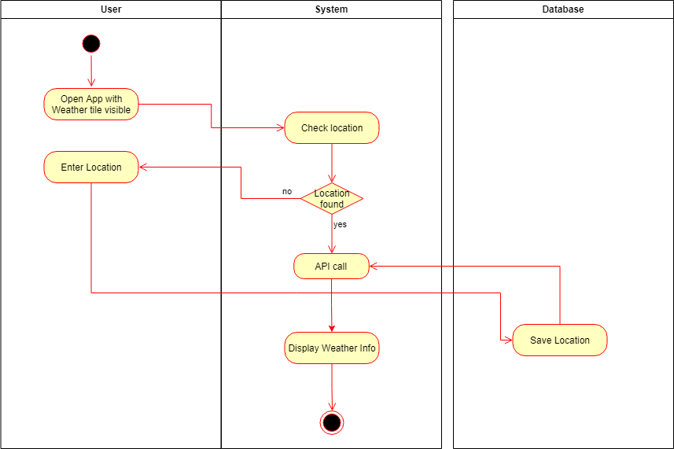

# 1 see weather

The user can see the weather at his desired location

## 1.1 Brief Description

## 1.1.1 Public

To see the weather at a desired location a user has to be logged in to an account.

## 1.1.2 Private

Every registered user can add customized tiles to his screen. One of these tiles can for example be the weather. To be able to see the weather, the user first has to enter the location to get the weather information from. After that the weather tile shows the weather at the location the user entered befordehand.

# 2 Flow of Events

## 2.1 Basic Flow

- User opens the app and the weather tile is visible
- System checks if location information is stored for the user, if this information is stored, the weather API is called and the weather information is displayed to the user
- if no location information can be found, the user has to enter a location
- the new location is saved to the database
- the API is called and the weather information is displayed to the user

### 2.1.1 Activity Diagram



### 2.1.2 Mock-up

tbd

<!--

-->

### 2.1.3 Narrative

```gherkin
Feature: see weather at entered location

  As a signed in user
  i want to see specific weather information

  Background:
    And I am on the homepage

  Scenario: requires a custom location on the database
    if a custom location is found
        call weather-API
            display weather-information
    else user has to enter a location
        call weather-API
        display weather-information
```

## 2.2 Alternative Flows

(n/a)

# 3 Special Requirements

(n/a)

# 4 Preconditions

## 4.1 Login

The user has to be logged in to the system.

# 5 Postconditions

(n/a)

# 6 Extension Points

(n/a)
