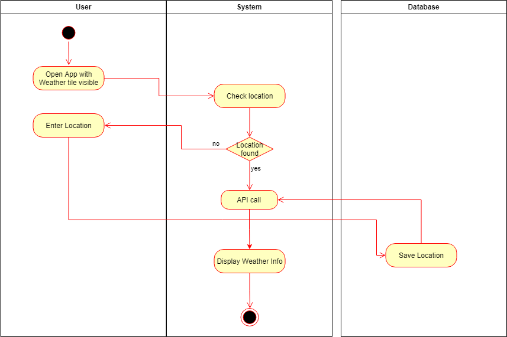

# 1 see an Cartoon 

The user can see a new cartoon every day

## 1.1 Brief Description

## 1.1.1 Public

To user has to be logged in to his account to see the website and thus the cartoon.

## 1.1.2 Private

Every registered user can add customized tiles to his screen. One of these tiles can for example be the cartoon. The tile can be deactivated in the cofiguration

# 2 Flow of Events

## 2.1 Basic Flow

- User opens the app and the cartoon tile is visible


### 2.1.1 Activity Diagram



### 2.1.2 Mock-up


<!--

-->

### 2.1.3 Narrative

```gherkin
Feature: see weather at entered location

  As a signed in user
  i want to see specific weather information

  Background:
    And I am on the homepage

  Scenario: requires a custom location on the database
    if a custom location is found
        call weather-API
            display weather-information
    else user has to enter a location
        call weather-API
        display weather-information
```

## 2.2 Alternative Flows

(n/a)

# 3 Special Requirements

(n/a)

# 4 Preconditions

## 4.1 Login

The user has to be logged in to the system.

# 5 Postconditions

(n/a)

# 6 Extension Points

(n/a)
